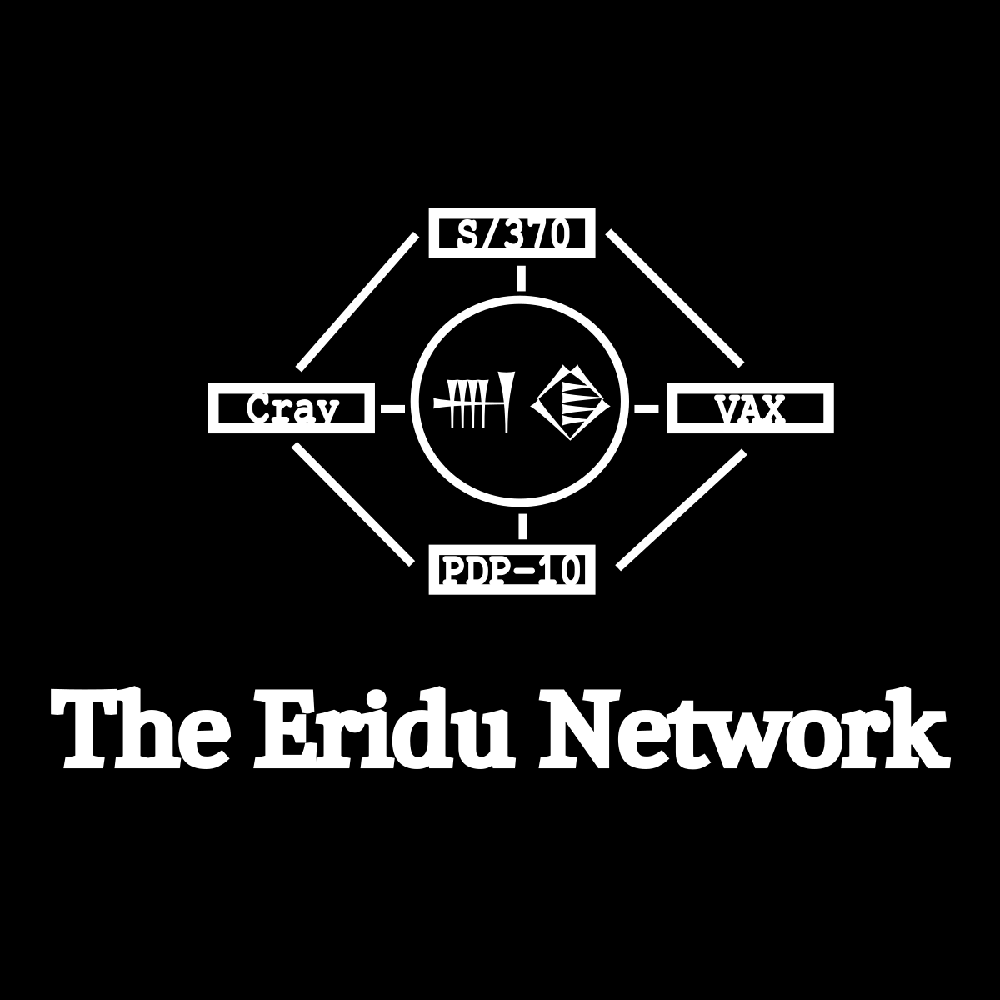

* Retronet

This project to create a network of mostly emulated machines running 'legacy' operating systems. The ultimate goal of this project is to learn as much as possible about older systems and networking, as I believe that computer history is something that should be better learned and understood more widely by those in technology. I hope that this project will serve as the infrastructure for other projects of mine, such as a web interface to interact with these systems and whatever else comes to my mind with all of the tools I will have avaliable.
* Current Status
The emulated VAX and PDP10 machines are currently running and working fine, they are both connected to TCPIP to Nabu and Enlil and support basic SMTP, FTP, and Finger (at least with the VAX) well enough now. The S/370 system is also running, with very limited connectivity to the rest of the network. Nabu is also working well, running most of the basic services avaliable on the network.
* The plan so far
** Main systems on the network
| Hostname | Architecture  | OS          | Purpose                      | IP (if applicable) | Alwyas online |
|----------+---------------+-------------+------------------------------+--------------------+---------------|
| Nabu     | amd64`        | Tribblix    | Main Unix server             |           10.2.2.5 | Y             |
| Nergal   | Microvax 3900 | OpenVMS 7.3 | Machine for user interaction |           10.2.2.3 | Y             |
| Enlil    | amd64         | OPNSense    | Router                       |           10.2.2.1 | Y             |
| Marduk   | KL-10         | TOPS-20     | Mainframe                    |           10.2.2.7 | Y             |
| Ashur    | S/370         | MVS 3.8J    | Mainframe                    |          10.2.2.9* | Y             |
| Inanna   | Cray-XP       | UNICOS      | Supercomputer                |          10.2.2.11 | N             |
| Enki     | IBM 709       | CTSS        | Exhibit                      |               N/A* | N             |
| Shamash  | HP3000        | MPE         | Exhibit                      |         10.2.2.13* | Y             |
| Adad     | Prime 300     | PRIMEOS     | Exhibit                      |          10.2.2.15 | Y             |
| Ishum    | Eclipse 8000  | AOS         | Exhibit                      |         10.2.2.17* | Y             |
| Ninurta  | B5000         | MCP         | Exhibit                      |         10.2.2.19* | Y             |
"*" - I am not sure if I can connect this machine to TCPIP
** Planned Workstations
| Name            | Type                     |        IP |
|-----------------+--------------------------+-----------|
| Sargon          | Sun-1/Sun-2/Sparcstation | 10.2.2.31 |
| Shulgi          | Apollo DN3500            | 10.2.2.33 |
| Utnapishtim     | Xerox Alto               | 10.2.2.35 |
| Gilgamesh       | Xerox Star               | 10.2.2.37 |
| Hammurabi       | Power Mac                | 10.2.2.39 |
| N/A             | Lilith                   |       N/A |
| N/A             | PERQ                     |       N/A |
| Sennacherib     | MIT CADR                 | 10.2.2.41 |
| Tiglath-Pileser | LambdaDelta              | 10.2.2.43 |
| N/A             | Interlisp (on Nabu)      |       N/A |
| N/A             | Smalltalk-80 (on Nabu)   |       N/A |
| Nebuchadnezzar  | Sun Blade 100            | 10.2.2.45 |
| Ashurbanipal    | SGI Indy                 | 10.2.2.47 |
* Why I am doing this
TODO
* Statement on AI
TODO
